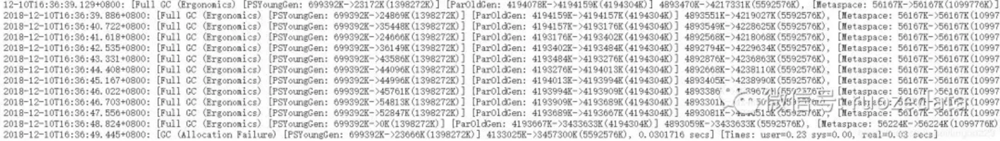

## 问题现象

通过Spark UI查看Executors，发现存在Executor Dead的情况


进一步查看dead Executor stderr日志，发现如下报错信息：


## 解决过程
<!--more--> 
<font color=#FF4500>打开GC日志，配置如下</font>

```
--conf "spark.executor.extraJavaOptions= -verbose:gc -XX:+PrintGCDetails -XX:+PrintGCDateStamps"
--conf "spark.driver.extraJavaOptions= -verbose:gc -XX:+PrintGCDetails -XX:+PrintGCDateStamps"
```

<font color=#FF4500>打开exeutor gc日志，发现一直在**full gc**，几乎每秒1次，基本处于拒绝服务状态</font>



<font size=4><b>至此找到问题原因，executor内存不够导致dead，调大executor内存即可 ，所以排错方法定位很重要！</b></font>